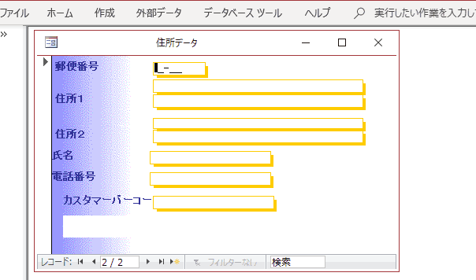
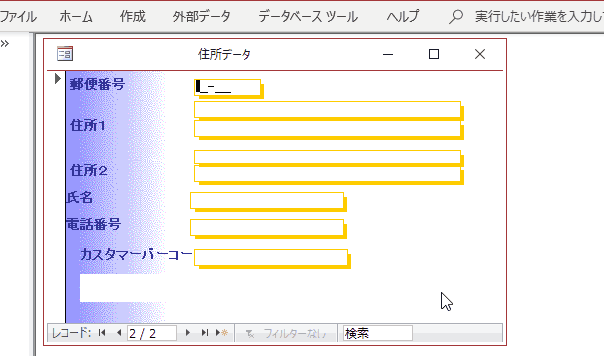
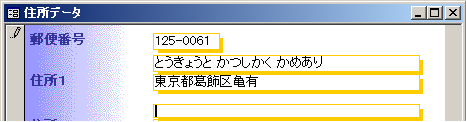

Access郵便番号入力支援
===========

日本郵便の公開している12万件の郵便番号データを使ってAccessの住所入力を効率化します。

### 概要

手書きの住所をパソコンに入力する場合、この『Access郵便番号入力支援』を使うと、住所入力が嘘のように簡単になります。 

#### ダウンロード

最新のプログラム ver1.14（日本郵便２０２２年９月３０日公開の郵便番号辞書を含む）は 
[ここからダウンロード できます。]( https://github.com/kkato233/ken_all_mdb/releases )

#### 機能説明

ダウンロードしたＺＩＰファイルを解凍すると「住所入力.mdb」「住所入力-郵便対応.mdb」[年賀状宛名.mdb」「ken_all変換.mdb」
という Access のファイルが含まれています。
まず「住所入力.mdb」を開いて見ましょう。 

#### ７桁郵便番号を入力すると住所が自動的に入る

郵便番号の欄に 160-0021 と入力してみます。
すると自動的に 住所１とふりがなが入ります。 

#### 住所を入力すると自動的に郵便番号まで入力される

郵便番号が分からないので郵便番号入力を飛ばして住所を入力しようとすると住所選択のダイアログが表示されます。
ここで「東京都」「葛飾区」を入力すると下の図のように次に入力するべき住所一覧が表示されて「亀有」を入力すると、

郵便番号が自動的に 125-0061と入力されます。

#### 企業の郵便番号に対応
配達物数の多い大口事業所を表す個別郵便番号にも対応しています。

#### カスタマーバーコードの自動生成対応

１０００通以上の郵送物を送る場合、カスタマーバーコードを印字すると 
[３％割引となります。 日本郵政　バーコード割引](https://www.post.japanpost.jp/zipcode/zipmanual/p30.html) 

[日本郵政　カスタマバーコード作成に必要な文字情報の抜き出しが正しいかどうかを検証するためのチェックシート](https://www.post.japanpost.jp/zipcode/zipmanual/p25.html)
でチェックすみです。

#### 京都の長い住所にも対応

京都の住所は、町名と通りの名前を使うので、日本郵便の郵便番号辞書を使うソフトによってはちゃんと入力できない物があります。
 試しに京都市中京区油屋町を入力してみましょう。

郵便番号辞書にある長い住所がすべて表示されます。目的の住所『富小路通蛸薬師下る』をコピーして住所欄に貼り付けすることで住所入力が楽になります。

#### 活用方法

この『Access郵便番号入力支援』でダウンロードする 住所録は かなりシンプルな作りになっています。 
この郵便番号入力支援のAccessはすべてのソースが閲覧できますのでご自分で作成した住所録に組み込む事も可能です。 

#### サポート

このソフトに対するお問い合わせは
 https://github.com/kkato233/ken_all_mdb/issues
 にバグ報告してください
