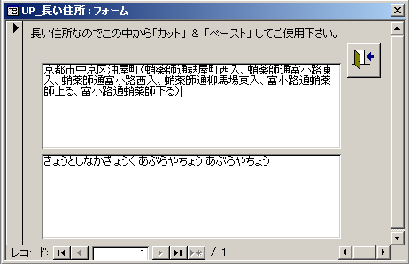

Access郵便番号入力支援
===========

郵政省の公開している12万件の郵便番号データを使ってAccessの住所入力を効率化します。

### 概要

Accessで標準で郵便番号を入力したら住所に変換する機能がありますがちょっとだけ 難点がありました。市町村合併が多く郵便番号を入れても合併後の住所が出てきません。 また、郵便番号が分からない場合に住所から郵便番号を調べるのも大変な苦労です。 住所で県の名前を書かずに入力してくる人や、漢字が難しすぎて漢字変換で入力する 読みが分からず苦労したり、よく似た別の漢字と間違って入力してしまったり。 こんな苦労をしたことがある人に朗報です。 この『Access郵便番号入力支援』をあなたの使っているAccessに組み込めば 今までの住所入力が嘘のように簡単になります。 

#### ダウンロード

最新のプログラム ver1.09（２０１８年１２月２８日版の辞書も含まれています。）は 
[ここからダウンロード できます。]( https://github.com/kkato233/ken_all_mdb/releases )

#### 機能説明

ダウンロードしたＺＩＰファイルを解凍すると「住所入力.mdb」「住所入力-郵便対応.mdb」[年賀状宛名.mdb」「ken_all変換.mdb」
という Access のファイルが含まれています。
まず「住所入力.mdb」を開いて見ましょう。 

#### ７桁郵便番号を入力すると住所が自動的に入る

郵便番号の欄に 160-0021 と入力してみます。
すると自動的に 住所１とふりがなが入ります。 

また、カスタマーバーコードも自動的に生成します。

#### 住所を入力すると自動的に郵便番号まで入力される

郵便番号が分からないので郵便番号入力を飛ばして住所を入力しようとすると住所選択のダイアログが表示されます。
ここで「東京都」「葛飾区」を入力すると下の図のように次に入力するべき住所一覧が表示されて「亀有」を入力すると、

郵便番号が自動的に 125-0061と入力されます。

#### 京都の長い住所にも対応

京都の住所は、町名と通りの名前を使うので、日本郵便の郵便番号辞書を使うソフトによってはちゃんと入力できない物があります。
 試しに京都市中京区油屋町を入力してみましょう。

郵便番号辞書にある長い住所がすべて表示されます。目的の住所『富小路通蛸薬師下る』をコピーして住所欄に貼り付けすることで住所入力がすこしは楽になります。

#### 活用方法

この『Access郵便番号入力支援』でダウンロードする 住所録は かなりシンプルな作りになっています。 
この郵便番号入力支援のAccessはすべてのソースが閲覧できますのでご自分で作成した住所録に組み込む事も可能です。 

#### 更新履歴

#### サポート

このソフトに対するお問い合わせは
 https://github.com/kkato233/ken_all_mdb/issues
 にバグ報告してください
